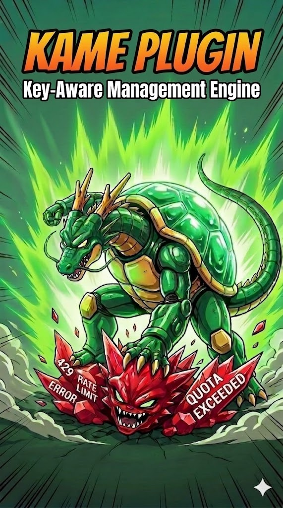

<div align="center">



# 🐢⚡ KAME — API Key Rotation

### One engine. One port per host. Your agent stops at the first 429 — mine does not.

[](https://github.com/Kame696/kame-api-rotation-for-agent-zero)
[](https://github.com/Kame696/kame-api-rotation-for-hermes)
[](#parity)
[](#license)

**This repository is the front door.** The code lives in one repository per host — pick yours below.

</div>

---

## 🎯 The problem, in one paragraph

You own several API keys. Your agent uses one of them. When that key hits a rate limit, runs out of daily quota, or the provider has a bad ten minutes, the call fails and **your turn ends** — while the other keys sit there, healthy, untouched.

**KAME picks the healthiest key for every call and, when a call fails, moves to the next one instead of giving up.** It reads the provider's own retry timing and rests that key for exactly that long. It tells a per-minute throttle from a daily cap, retries Gemini's bare `429 RESOURCE_EXHAUSTED` on a short 1-2-4-8s ladder, never holds a healthy key longer than an hour, and when the whole pool is resting it waits for the first key back rather than burning requests proving they are still down.

There is **no provider allowlist anywhere in it.** Every decision is made on evidence in the response — retry timing, rate-limit headers, the shape of the error body. A provider released next year is covered by the same rules.

## 🚪 Pick your host

<table>
<tr>
<td width="50%" valign="top">

### 🅰️ Agent Zero

**[kame-api-rotation-for-agent-zero →](https://github.com/Kame696/kame-api-rotation-for-agent-zero)**

Install from the **Plugin Hub** inside Agent Zero (search **KAME**), or drop the folder into `/a0/usr/plugins/`.

Verified in **real sessions on Agent Zero v2.12** — real Gemini keys, 26 of 26 calls answered — and supports v1.14+ and the whole V2 line.

</td>
<td width="50%" valign="top">

### 🅷 Hermes

**[kame-api-rotation-for-hermes →](https://github.com/Kame696/kame-api-rotation-for-hermes)**

```bash
hermes plugins install Kame696/kame-api-rotation-for-hermes/hermes-kame-api-rotation
hermes plugins enable hermes-kame-api-rotation
```

Tested on **Hermes 0.21.1 and 0.21.3**, 2,829 tests, `hermes plugins validate` security scan **safe**, no third-party packages.

</td>
</tr>
</table>

<a id="parity"></a>
## 🔢 Version parity

The two ports share a version line on purpose: **the same number means the same rules on both hosts.** A release on one side raises the other.

| | Agent Zero | Hermes |
|---|---|---|
| Current | **1.8.1.0** | **1.8.1.0** |
| Picks the healthiest key per call | ✅ | ✅ |
| Reads the provider's own retry timing | ✅ | ✅ |
| Daily cap told apart from a per-minute throttle | ✅ | ✅ |
| Gemini `RESOURCE_EXHAUSTED` ladder (1-2-4-8…64s) | ✅ | ✅ |
| No key held longer than an hour | ✅ | ✅ |
| Health remembered per `provider:model` | ✅ | ✅ |
| Invalid key taken out of rotation instead of ending the run | ✅ | ✅ |
| Waits out a fully-resting pool, and says so on screen | ✅ | ✅ |
| Continues an answer the provider cut mid-stream | — *(host owns the stream)* | ✅ |
| One health file shared by several profiles | — *(one process)* | ✅ |
| Bulk key import from chat (`/kame-keys`) | — | ✅ |
| Status chip + panel in a desktop shell | chip beside the composer | ✅ |

The dashes are not missing features. They are jobs the other host already does itself — and the one design rule of this project is that **KAME does not re-implement its host.**

## 🧠 The one design rule

KAME **only chooses the key**. The request, the stream, the parsing and the result belong to the host, untouched. That is why one build survives host upgrades: the plugin carries no copy of the host's model call to go stale.

## ❤️ Support the project

KAME is free, MIT, and built by one person against real quotas. No company, no telemetry, nothing to upsell. If it saved you a run, a tip keeps it going:

**Bitcoin** — `36BGYhMEVFgY8PLGMVux93pjGt92KVM6dJ`

And a ⭐ on either port costs nothing and helps other people find it.

<a id="license"></a>
## 📜 License

MIT, both ports. See each repository's `LICENSE`.

<div align="center">

Built by [**KAME**](https://github.com/Kame696) · Discord `kame055856`

*Not affiliated with Agent Zero or Nous Research. Just a person with too many API keys and not enough quota.*

</div>
